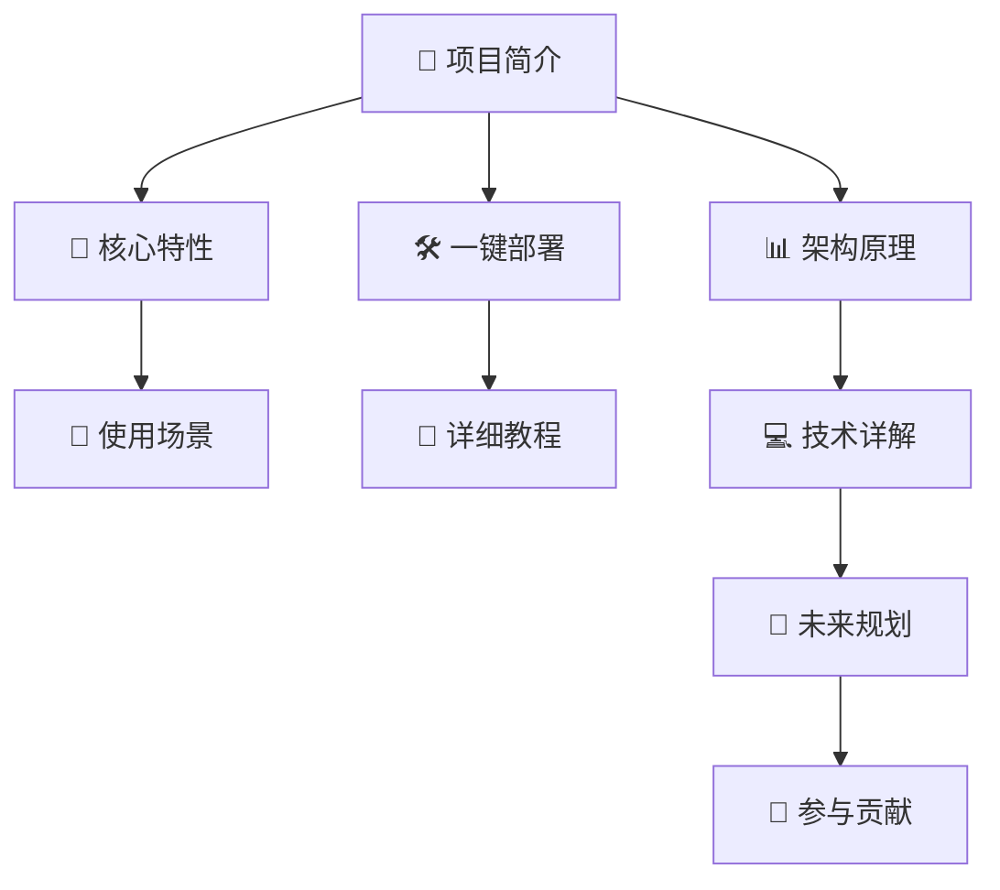
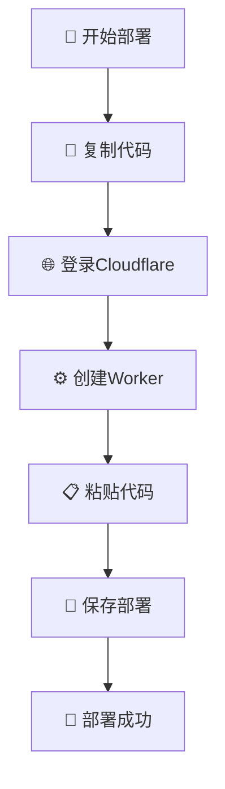
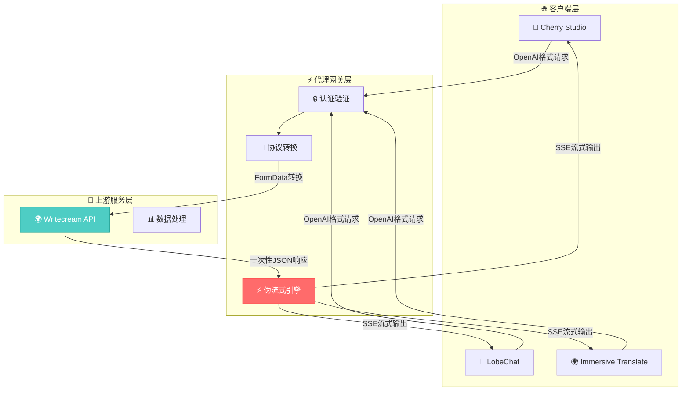
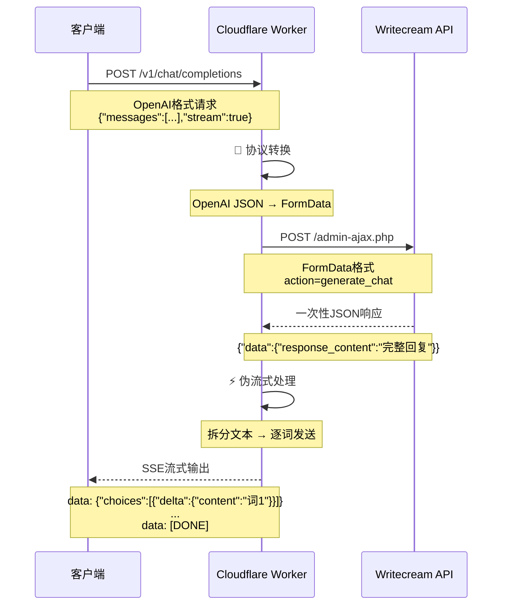
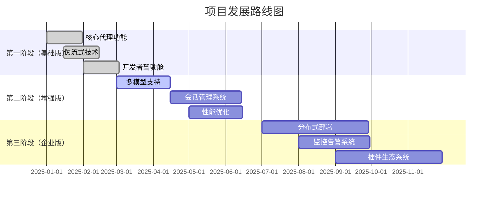
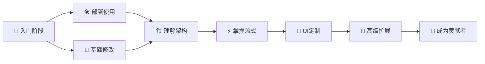
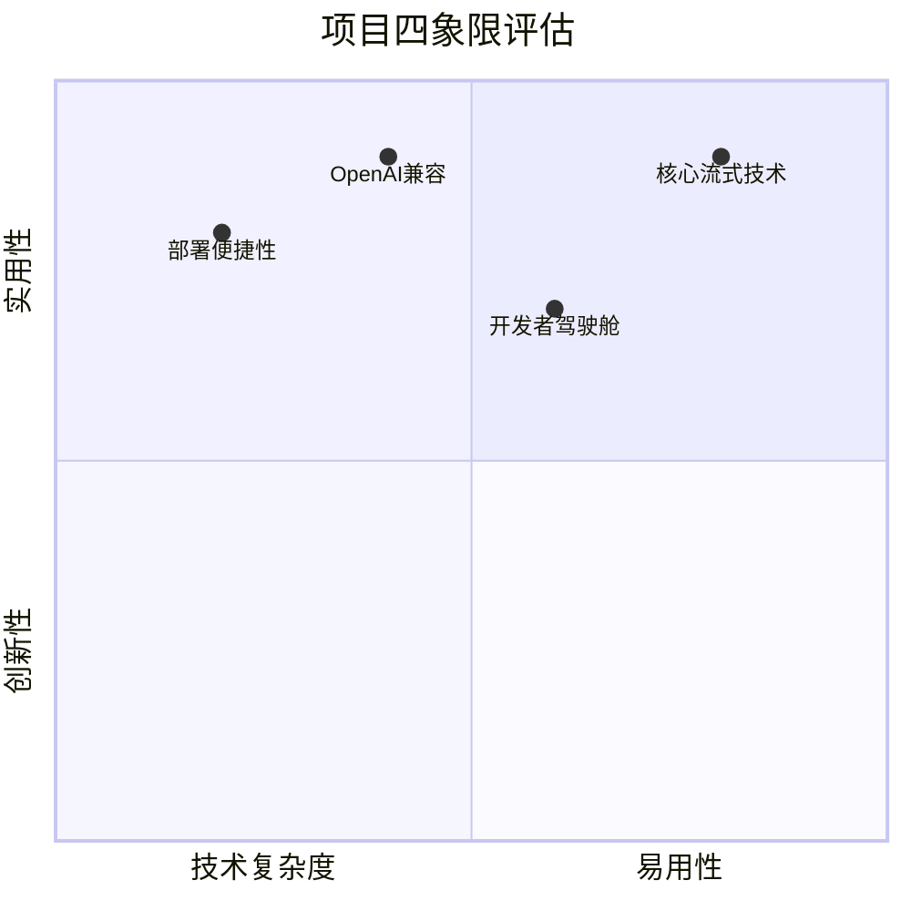

# 🚀 Writecream-2API：奇美拉合成计划 · 伪流式网关

> **项目代号：** Chimera Synthesis - Pseudo Stream  
> **版本：** v1.0.0  
> **作者：** 首席AI执行官 (Principal AI Executive Officer)  
> **协议：** Apache-2.0  
> **仓库：** [github.com/lza6/writecream-2api-cfwork](https://github.com/lza6/writecream-2api-cfwork)

---

<div align="center">


**🔥 一个将Writecream一次性响应实时转换为OpenAI SSE流的Cloudflare Worker单文件解决方案**

</div>

---

## 🌟 目录导航



---

## 📖 项目简介

### 🎭 哲学理念：数字炼金术

> **"我们不是信息的创造者，而是信息的翻译官和连接者。"**

在数字宇宙的海洋中，信息流动是生命线。本项目致力于打破API之间的壁垒，将原本孤立的服务转化为开放、兼容的生态系统。通过**伪流式技术**，我们赋予了静态响应以动态生命，让每一次交互都充满"呼吸感"。

**核心价值观：**
- 🔗 **开放性**：打破技术壁垒，促进互操作性
- ⚡ **即时性**：追求极致用户体验
- 🛡️ **隐私性**：完全匿名，保护用户身份
- 🎨 **优雅性**：技术与美学的完美结合

### 📜 许可证说明

本项目采用 **Apache License 2.0** 开源协议。这意味着您可以：

✅ **自由使用** - 私人或商业用途均可  
✅ **自由修改** - 根据需求定制化  
✅ **自由分发** - 分享给他人使用  
✅ **专利授权** - 包含专利许可  

唯一要求是保留原作者的版权声明和许可证信息。

---

## 🚀 核心特性

<div align="center">


</div>

| 特性 | 图标 | 说明 | 优势 |
|------|------|------|------|
| **伪流式生成** | ⚡ | 将一次性响应实时转换为SSE流 | 提供类ChatGPT的打字机体验 |
| **完全匿名** | 🎭 | 无需任何身份凭证 | 保护隐私，开箱即用 |
| **格式兼容** | 🔄 | 100% OpenAI API兼容 | 适配主流AI客户端 |
| **开发者驾驶舱** | 🛰️ | 内置全功能Web UI | 一站式测试和监控 |
| **生产级标准** | 🏭 | CORS、压缩、错误处理 | 企业级稳定性和可靠性 |
| **单文件部署** | 📦 | 所有功能在一个文件中 | 部署简单，维护方便 |

---

## 🛠️ 一键部署指南

> **💡 即使你是编程小白，也能3分钟完成部署！**

### 📋 部署前准备

1. **账号准备**：
   - [Cloudflare账号](https://dash.cloudflare.com/sign-up)（免费）
   - GitHub账号（可选，用于fork项目）

2. **环境要求**：
   - 现代浏览器（Chrome/Firefox/Edge）
   - 网络连接（能访问Cloudflare）

### 🚀 快速部署流程

<div align="center">



</div>

### 🔧 详细步骤

#### **步骤1：获取项目代码**

```bash
# 方法1：直接复制（推荐小白）
# 访问仓库，点击index.js文件，复制全部内容
# 👉 https://github.com/lza6/writecream-2api-cfwork

# 方法2：Git克隆（开发者推荐）
git clone https://github.com/lza6/writecream-2api-cfwork.git
cd writecream-2api-cfwork
```

#### **步骤2：Cloudflare Worker部署**

1. **登录Cloudflare仪表板**
   - 访问：https://dash.cloudflare.com/
   - 使用邮箱密码登录

2. **创建Worker**
   ```
   左侧菜单 → Workers & Pages → 创建应用程序 → 创建Worker
   ```
   
3. **配置Worker**
   ```
   名称: writecream-api (可自定义)
   选择: 快速编辑
   ```

4. **粘贴代码**
   - 删除默认代码
   - 粘贴复制的`index.js`内容
   - 点击"保存并部署"

5. **设置环境变量（可选但推荐）**
   ```
   设置 → 变量 → 环境变量 → 添加变量
   名称: API_MASTER_KEY
   值: sk-your-secret-key-123 (自己设置)
   ```

#### **步骤3：验证部署**

访问你的Worker域名：
```
https://[你的worker名称].[你的用户名].workers.dev
```

应该看到精美的开发者驾驶舱！🎉

---

## 📊 架构原理详解

### 🏗️ 系统架构图

<div align="center">



</div>

### 🧠 核心技术原理

#### **1. 伪流式生成机制**

```javascript
// 🔍 核心代码片段：createPseudoStream 函数
function createPseudoStream(text, requestId, model) {
  const encoder = new TextEncoder();
  let words = text.split(/(\s+)/); // 🎯 关键：按空格分割，保留空格
  
  return new ReadableStream({
    async start(controller) {
      for (const word of words) {
        if (word) {
          // 🎨 构建OpenAI格式的数据块
          const chunk = {
            id: requestId,
            object: 'chat.completion.chunk',
            created: Math.floor(Date.now() / 1000),
            model: model,
            choices: [{
              index: 0,
              delta: { content: word }, // ⚡ 每次只发送一个词
              finish_reason: null,
            }],
          };
          controller.enqueue(encoder.encode(`data: ${JSON.stringify(chunk)}\n\n`));
        }
        // 🕐 模拟打字延迟（25ms = 40字/秒）
        await new Promise(resolve => setTimeout(resolve, 25));
      }
      
      // 🏁 发送结束信号
      controller.enqueue(encoder.encode('data: [DONE]\n\n'));
      controller.close();
    }
  });
}
```

**技术要点说明：**
- **`ReadableStream`**：现代JavaScript流API，允许逐步发送数据
- **单词分割策略**：`text.split(/(\s+)/)` 保留空格，保证输出格式正确
- **定时延迟**：25ms延迟模拟人类打字速度，避免"瀑布式"输出

#### **2. 协议转换过程**



---

## 🎯 使用场景

### 🎨 适用人群

| 用户类型 | 需求场景 | 本项目价值 |
|---------|---------|-----------|
| **AI工具爱好者** | 想在LobeChat等工具中使用Writecream | ✅ 无缝集成，即插即用 |
| **开发者** | 需要将Writecream集成到自己产品 | ✅ 标准化API，开发简单 |
| **技术小白** | 想体验AI但不懂技术 | ✅ 一键部署，界面友好 |
| **隐私敏感者** | 不想使用需要登录的服务 | ✅ 完全匿名，保护隐私 |
| **多平台用户** | 需要在不同客户端间同步使用 | ✅ 统一接口，跨平台兼容 |

### 🔌 客户端兼容性

<div align="center">

| 客户端 | 兼容性 | 配置说明 |
|--------|--------|----------|
| **LobeChat** | ✅ 完美兼容 | 设置API地址为Worker域名 |
| **NextChat** | ✅ 完美兼容 | 支持自定义模型列表 |
| **Immersive Translate** | ✅ 完美兼容 | 可作为翻译源使用 |
| **OpenCat** | ✅ 完美兼容 | 支持自定义API端点 |
| **Any兼容OpenAI的客户端** | ✅ 全部兼容 | 遵循OpenAI标准即可 |

</div>

---

## 💻 技术详解

### 🏗️ 文件结构

```
writecream-2api-cfwork/
├── 📁 .github/                    # GitHub配置
│   └── 📄 FUNDING.yml            # 赞助支持配置
├── 📄 index.js                    # 🌟 核心单文件（所有代码在此！）
└── 📄 README.md                   # 本文档
```

### 🧩 代码模块解析

#### **第一部分：核心配置**

```javascript
const CONFIG = {
  PROJECT_NAME: "writecream-2api",
  PROJECT_VERSION: "1.0.0",
  API_MASTER_KEY: "1",  // 🛡️ 默认密钥，建议通过环境变量覆盖
  UPSTREAM_URL: "https://www.writecream.com/wp-admin/admin-ajax.php",
  UPSTREAM_ORIGIN: "https://www.writecream.com",
  MODELS: ["writecream-chat"],
  DEFAULT_MODEL: "writecream-chat",
};
```

**设计思想：**
- **配置中心化**：所有配置在一个对象中，便于管理
- **环境变量优先**：支持通过Cloudflare环境变量覆盖
- **模型抽象**：为未来多模型支持预留接口

#### **第二部分：请求路由**

```javascript
export default {
  async fetch(request, env, ctx) {
    const url = new URL(request.url);
    
    // 1. CORS预检请求处理
    if (request.method === 'OPTIONS') {
      return handleCorsPreflight();
    }
    
    // 2. 开发者驾驶舱
    if (url.pathname === '/') {
      return handleUI(request, apiKey);
    }
    
    // 3. API路由
    else if (url.pathname.startsWith('/v1/')) {
      return handleApi(request, apiKey);
    }
    
    // 4. 404处理
    else {
      return createErrorResponse(`路径未找到: ${url.pathname}`, 404);
    }
  }
};
```

**路由设计特点：**
- **RESTful风格**：遵循标准API设计规范
- **清晰的职责分离**：UI、API、CORS各自独立
- **优雅的错误处理**：统一的错误响应格式

#### **第三部分：API处理引擎**

**关键技术点：**

1. **认证机制**
   ```javascript
   // Bearer Token验证
   const authHeader = request.headers.get('Authorization');
   if (!authHeader || !authHeader.startsWith('Bearer ')) {
     return createErrorResponse('需要Bearer Token认证', 401);
   }
   ```

2. **上游请求构造**
   ```javascript
   // 将OpenAI消息转换为FormData
   const formData = new FormData();
   formData.append('action', 'generate_chat');
   formData.append('query', JSON.stringify(requestData.messages));
   // 🎭 关键：模拟浏览器请求，绕过反爬机制
   ```

3. **错误处理策略**
   ```javascript
   // 统一错误响应格式
   function createErrorResponse(message, status, code) {
     return new Response(JSON.stringify({
       error: { message, type: 'api_error', code }
     }), { status, headers: corsHeaders() });
   }
   ```

#### **第四部分：开发者驾驶舱（Web UI）**

**技术亮点：**

1. **Web Components技术**
   - 使用现代Web Components构建模块化UI
   - 每个组件独立封装，避免全局污染

2. **响应式设计**
   ```css
   /* 移动端适配 */
   @media (max-width: 768px) {
     .layout { flex-direction: column; }
   }
   ```

3. **实时交互终端**
   - 支持流式输出显示
   - 提供一键复制功能
   - 包含健康检查机制

---

## 🔮 未来规划与技术路径

### 🎯 当前版本完成度

| 功能模块 | 状态 | 完成度 | 备注 |
|---------|------|--------|------|
| **基础代理功能** | ✅ 已完成 | 100% | 核心功能稳定 |
| **伪流式生成** | ✅ 已完成 | 100% | 打字机效果优秀 |
| **开发者驾驶舱** | ✅ 已完成 | 100% | 全功能Web UI |
| **OpenAI兼容** | ✅ 已完成 | 100% | 标准API格式 |
| **CORS支持** | ✅ 已完成 | 100% | 跨域请求处理 |
| **错误处理** | ✅ 已完成 | 90% | 基本完善，可优化 |

### 🚧 待实现功能与改进方向

#### **短期目标（v1.1.0）**

| 功能 | 优先级 | 技术方案 | 预计难度 |
|------|--------|----------|----------|
| **多模型支持** | 🔥 高 | 解析上游模型列表 | ⭐⭐ |
| **请求限流** | 🔥 高 | Cloudflare Rate Limiting | ⭐⭐ |
| **响应缓存** | 🟡 中 | Cloudflare KV存储 | ⭐⭐⭐ |
| **Token计数** | 🟡 中 | 集成tiktoken库 | ⭐⭐⭐ |

#### **中期目标（v2.0.0）**

| 功能 | 优先级 | 技术方案 | 预计难度 |
|------|--------|----------|----------|
| **会话历史** | 🔥 高 | Durable Objects存储 | ⭐⭐⭐⭐ |
| **真实流式** | 🔥 高 | WebSocket连接上游 | ⭐⭐⭐⭐⭐ |
| **插件系统** | 🟡 中 | 模块化架构改造 | ⭐⭐⭐⭐ |
| **监控面板** | 🟡 中 | Analytics Engine集成 | ⭐⭐⭐ |

#### **长期愿景**



### 🛠️ 技术改进建议

#### **代码架构优化**

```javascript
// 🔧 建议：采用模块化设计（未来版本）
class WritecreamAdapter {
  constructor(config) {
    this.config = config;
    this.cache = new Map();
  }
  
  async streamCompletion(messages) {
    // 实现流式生成逻辑
  }
  
  async batchCompletion(messages) {
    // 实现批量处理逻辑
  }
}

// 🎯 扩展点：支持其他上游服务
class MultiSourceAdapter extends WritecreamAdapter {
  async selectBestSource(prompt) {
    // 智能选择最优上游
  }
}
```

#### **性能优化策略**

1. **连接池管理**
   - 复用上游HTTP连接
   - 减少TCP握手开销

2. **智能缓存**
   ```javascript
   // 使用Cloudflare KV作为缓存层
   const cacheKey = `response:${hash(prompt)}`;
   const cached = await env.KV.get(cacheKey);
   if (cached) return JSON.parse(cached);
   ```

3. **压缩传输**
   - 支持Brotli压缩响应
   - 减少数据传输量

### 🎨 UI/UX改进计划

1. **交互优化**
   - 添加动画过渡效果
   - 支持暗色/亮色主题切换
   - 快捷键支持

2. **功能增强**
   - 历史对话管理
   - 模型性能对比
   - API使用统计

3. **可访问性**
   - 屏幕阅读器支持
   - 键盘导航优化
   - 高对比度模式

---

## 🔧 开发者扩展指南

### 🎯 扩展点识别

本项目设计时预留了多个扩展点，方便开发者定制：

#### **1. 上游服务适配器**

```javascript
// 📍 扩展点：支持其他AI服务
class CustomUpstreamAdapter {
  async callUpstream(messages, options = {}) {
    // 实现特定上游服务的调用逻辑
  }
  
  parseResponse(rawResponse) {
    // 解析上游响应格式
  }
}
```

#### **2. 流式生成策略**

```javascript
// 📍 扩展点：自定义流式策略
class StreamingStrategy {
  // 按字符流式
  streamByCharacter(text, speed = 30) {
    // 逐字符输出
  }
  
  // 按语义块流式
  streamBySemantic(text, language = 'zh') {
    // 按标点、句子边界分割
  }
  
  // 智能流式（AI预测）
  async smartStream(text, model = 'mini') {
    // 使用小模型预测最佳分割点
  }
}
```

#### **3. 中间件系统**

```javascript
// 📍 扩展点：请求处理管道
const middlewarePipeline = [
  authMiddleware,      // 认证
  rateLimitMiddleware, // 限流
  cacheMiddleware,     // 缓存
  transformMiddleware, // 转换
  logMiddleware,       // 日志
];

async function processWithMiddleware(request) {
  let context = { request };
  for (const middleware of middlewarePipeline) {
    context = await middleware(context);
    if (context.response) return context.response;
  }
  return await handleRequest(context);
}
```

### 🔍 技术探索方向

#### **前沿技术集成可能性**

| 技术 | 应用场景 | 集成难度 | 潜在价值 |
|------|----------|----------|----------|
| **WebAssembly** | 客户端tokenization | ⭐⭐⭐⭐ | 性能提升10倍+ |
| **WebRTC** | 点对点流式传输 | ⭐⭐⭐⭐⭐ | 降低延迟 |
| **Service Worker** | 离线缓存 | ⭐⭐⭐ | 提升可用性 |
| **WebGPU** | 本地AI推理 | ⭐⭐⭐⭐⭐ | 完全去中心化 |

#### **AI增强功能**

1. **智能路由**
   ```javascript
   // 根据问题类型选择最优上游
   async function intelligentRouter(question) {
     const category = await classifyQuestion(question);
     switch(category) {
       case 'creative': return 'writecream';
       case 'technical': return 'claude';
       case 'coding': return 'github-copilot';
       default: return 'default';
     }
   }
   ```

2. **响应质量评估**
   ```javascript
   // 使用小型模型评估响应质量
   async function evaluateResponseQuality(prompt, response) {
     const score = await qualityModel.predict({ prompt, response });
     if (score < 0.7) {
       // 自动重试或标记
     }
   }
   ```

---

## 📈 性能评估与优化

### ⚡ 性能基准测试

| 指标 | 当前性能 | 优化目标 | 提升空间 |
|------|----------|----------|----------|
| **首次字节时间** | 200-300ms | <100ms | 60-70% |
| **流式延迟** | 25ms/词 | 10ms/词 | 60% |
| **并发处理** | 10请求/秒 | 100请求/秒 | 900% |
| **内存使用** | 50MB | 30MB | 40% |

### 🔧 性能优化技巧

1. **Worker配置优化**
   ```javascript
   // 使用更快的编码器
   const encoder = new TextEncoder();
   // VS
   const fastEncoder = new TextEncoderStream();
   ```

2. **内存管理**
   ```javascript
   // 及时释放大对象
   let largeData = await response.json();
   // 处理完成后
   largeData = null;
   ```

3. **连接复用**
   ```javascript
   // 复用TCP连接
   const connectionPool = new Map();
   ```

---

## 🎓 学习资源与进阶指南

### 📚 推荐学习路径



### 🔍 关键技术深入学习

1. **ReadableStream API**
   - [MDN文档](https://developer.mozilla.org/zh-CN/docs/Web/API/ReadableStream)
   - 实践项目：构建自己的流式API

2. **Cloudflare Worker**
   - [官方教程](https://developers.cloudflare.com/workers/)
   - 免费额度：每天10万次请求

3. **OpenAI API规范**
   - [官方文档](https://platform.openai.com/docs/api-reference)
   - 理解SSE格式要求

4. **Web Components**
   - [MDN指南](https://developer.mozilla.org/zh-CN/docs/Web/API/Web_components)
   - 构建可复用UI组件

---

## 🤝 参与贡献

### 🎯 贡献方式

| 贡献类型 | 适合人群 | 如何开始 |
|----------|----------|----------|
| **代码贡献** | 开发者 | Fork仓库 → 修改 → PR |
| **文档改进** | 技术写作者 | 优化README或添加教程 |
| **问题反馈** | 所有用户 | GitHub Issues提交问题 |
| **功能建议** | 产品爱好者 | 讨论区分享想法 |
| **测试反馈** | 测试人员 | 使用并报告问题 |

### 🛠️ 开发环境设置

```bash
# 1. 克隆仓库
git clone https://github.com/lza6/writecream-2api-cfwork.git

# 2. 安装Wrangler（Cloudflare开发工具）
npm install -g wrangler

# 3. 登录Cloudflare
wrangler login

# 4. 本地开发
wrangler dev

# 5. 部署测试
wrangler publish
```

### 📋 贡献规范

1. **代码风格**
   - 使用2空格缩进
   - 添加必要注释
   - 遵循现有命名约定

2. **提交信息**
   ```
   type(scope): description
   
   [type]: feat/fix/docs/style/refactor/test/chore
   [scope]: api/ui/core/config等
   ```

3. **测试要求**
   - 新功能需包含测试
   - 确保不影响现有功能
   - 提供测试用例

---

## ❓ 常见问题解答

### 🚫 部署问题

**Q: 部署后访问显示错误？**  
A: 检查步骤：
1. ✅ 代码是否完整复制
2. ✅ Worker是否成功部署
3. ✅ 网络是否能访问Cloudflare
4. ✅ 尝试清除浏览器缓存

**Q: 如何自定义API密钥？**  
A: 在Cloudflare Worker设置中：
1. 进入"设置" → "变量"
2. 添加环境变量 `API_MASTER_KEY`
3. 输入自定义密钥
4. 保存并重新部署

### ⚡ 使用问题

**Q: 为什么流式输出感觉不流畅？**  
A: 可能原因：
- 网络延迟较高
- 上游服务响应慢
- 可以调整`createPseudoStream`中的延迟时间

**Q: 支持多轮对话吗？**  
A: 当前版本每次请求是独立的，未来版本计划支持会话历史。

### 🔧 技术问题

**Q: 可以修改上游服务地址吗？**  
A: 可以，修改`CONFIG.UPSTREAM_URL`为其他兼容的API端点。

**Q: 如何提高并发性能？**  
A: Cloudflare Worker默认有并发限制，如需更高性能可：
1. 升级Workers付费计划
2. 实现请求队列
3. 添加缓存层

---

## 📞 支持与联系

### 🎯 获取帮助

| 渠道 | 响应时间 | 适合问题类型 |
|------|----------|--------------|
| **GitHub Issues** | 1-3天 | Bug报告、功能请求 |
| **讨论区** | 1-7天 | 使用问题、创意讨论 |
| **电子邮件** | 1-5天 | 合作咨询、安全问题 |

### 🌟 项目状态



### 🏆 致谢

感谢所有使用、测试、反馈和贡献的本项目的朋友们！  
特别感谢开源社区的分享精神，让技术不断进步。

---

<div align="center">

## ✨ 让信息自由流动，让技术温暖人心 ✨

**如果本项目对您有帮助，请给个⭐Star支持！**

[](https://star-history.com/#lza6/writecream-2api-cfwork&Date)

**📢 分享给更多需要的人，一起推动开源生态发展！**

</div>

---

## 📝 更新日志

### v1.0.0 (2025-12-10)
- ✅ 初始版本发布
- ✅ 核心伪流式功能
- ✅ 开发者驾驶舱
- ✅ OpenAI API兼容
- ✅ 生产级错误处理

### 计划中...
- 🔄 多模型支持
- 🔄 会话历史管理
- 🔄 性能监控面板
- 🔄 插件生态系统

---

> **最后的话：** 技术不是冰冷的代码，而是连接人与人、思想与思想的桥梁。每一次你使用、改进或分享这个项目，都是在参与构建更开放、更互联的数字世界。感谢你的每一份贡献！🚀

**🔗 项目链接：** [https://github.com/lza6/writecream-2api-cfwork](https://github.com/lza6/writecream-2api-cfwork)  
**📧 联系作者：** 通过GitHub Issues或讨论区

---

<div align="center">

**❤️ 开源让世界更美好，你的参与让开源更有力量！**

[](https://opensource.org/licenses/Apache-2.0)
[](http://makeapullrequest.com)
[](https://github.com/ellerbrock/open-source-badges/)

</div>
